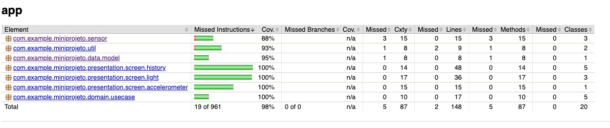

# 📱 SensorMonitor

Aplicativo Android para monitoramento de sensores em tempo real, desenvolvido como **Mini Projeto** da disciplina de Desenvolvimento Mobile.

---

## 📋 Sobre o Projeto

O **SensorMonitor** utiliza sensores reais do dispositivo Android (acelerômetro e sensor de luz) para capturar, exibir e armazenar dados sensoriais. O app segue a arquitetura **MVVM + Clean Architecture** com **Jetpack Compose** para UI, **Hilt** para injeção de dependência e persistência com **SQLite**.

---

## ✅ Requisitos Atendidos

| Requisito | Implementação |
|---|---|
| Sensor real | Acelerômetro (`TYPE_ACCELEROMETER`) e Sensor de Luz (`TYPE_LIGHT`) |
| Interface interativa | 4 telas Compose com interação do usuário |
| UI declarativa | Jetpack Compose com Material3 e tema dark personalizado |
| Navegação | Compose Navigation (`NavHost`) — Single-Activity |
| Exibição em tempo real | `SensorEventListener` com atualização contínua via `StateFlow` |
| Banco de dados SQLite | `SQLiteOpenHelper` com operações de inserção, consulta e exclusão |
| Arquitetura | MVVM + Clean Architecture com camadas `data → domain → presentation` |
| Injeção de dependência | Hilt (`@HiltViewModel`, `@Inject`, `@Module`) |

---

## 🖥️ Telas do Aplicativo

### 1. Tela Principal (`MainScreen`)
- Menu com 3 cards clicáveis para navegar entre funcionalidades
- Cards coloridos para Acelerômetro, Sensor de Luz e Histórico
- Hero card com status do sistema e badges

### 2. Acelerômetro (`AccelerometerScreen`)
- Exibição em tempo real dos eixos **X**, **Y** e **Z** (m/s²)
- Barras de progresso coloridas para cada eixo
- Cálculo da **magnitude** do vetor aceleração
- **Detecção de agitação (shake)** — vibra o dispositivo ao detectar movimento intenso
- Botão para **salvar leitura** no banco de dados
- Estado gerenciado via `AccelerometerViewModel` + `StateFlow`

### 3. Sensor de Luz (`LightSensorScreen`)
- Exibição do valor de luminosidade em **lux**
- **Cor de fundo dinâmica** — muda conforme o nível de luz ambiente:
  - 🌙 Muito Escuro → 🌑 Escuro → 🏠 Interno → ☁ Moderado → 🌤 Claro → ☀ Muito Claro → 🔆 Luz Solar
- Barra de progresso proporcional
- Botão para **salvar leitura** no banco de dados
- Estado gerenciado via `LightSensorViewModel` + `StateFlow`

### 4. Histórico (`HistoryScreen`)
- Lista todas as leituras salvas usando `LazyColumn`
- Indicador colorido por tipo de sensor
- Exibe valores e data/hora de cada registro
- Botão de **lixeira** em cada item para **deletar individualmente**
- Botão para **limpar todo o histórico**
- Estado gerenciado via `HistoryViewModel` + `StateFlow`

---

## 🏗️ Arquitetura — MVVM + Clean Architecture

```
com.example.miniprojeto/
├── SensorMonitorApp.kt              ← @HiltAndroidApp
├── data/                             ← CAMADA DE DADOS
│   ├── database/SensorDatabaseHelper.kt    (SQLite)
│   ├── model/SensorReading.kt              (Data class)
│   └── repository/SensorRepository.kt      (Implementação)
├── di/                               ← INJEÇÃO DE DEPENDÊNCIA
│   └── AppModule.kt                        (Hilt Module)
├── domain/                           ← CAMADA DE DOMÍNIO
│   ├── repository/SensorRepositoryInterface.kt  (Interface)
│   └── usecase/                             (Casos de Uso)
│       ├── SaveAccelerometerReadingUseCase.kt
│       ├── SaveLightReadingUseCase.kt
│       ├── GetAllReadingsUseCase.kt
│       ├── DeleteReadingUseCase.kt
│       └── ClearAllReadingsUseCase.kt
├── presentation/                     ← CAMADA DE APRESENTAÇÃO
│   ├── components/CommonComponents.kt      (Composables reutilizáveis)
│   ├── navigation/
│   │   ├── Screen.kt                       (Rotas)
│   │   └── AppNavGraph.kt                  (NavHost)
│   └── screen/
│       ├── main/MainScreen.kt              (Tela principal)
│       ├── accelerometer/
│       │   ├── AccelerometerScreen.kt       (Composable)
│       │   ├── AccelerometerViewModel.kt    (ViewModel + StateFlow)
│       │   └── AccelerometerUiState.kt      (Estado)
│       ├── light/
│       │   ├── LightSensorScreen.kt
│       │   ├── LightSensorViewModel.kt
│       │   └── LightSensorUiState.kt
│       └── history/
│           ├── HistoryScreen.kt
│           ├── HistoryViewModel.kt
│           └── HistoryUiState.kt
├── sensor/                           ← HANDLERS (mantidos)
│   ├── BaseSensorHandler.kt                (Interface)
│   ├── AccelerometerHandler.kt             (Processa dados)
│   ├── LightSensorHandler.kt              (Processa dados)
│   └── ShakeDetector.kt                   (Detecção de agitação)
├── ui/
│   ├── main/MainActivity.kt               (Single-Activity @AndroidEntryPoint)
│   └── theme/ (Color.kt, Theme.kt, Type.kt)
└── util/                             ← UTILITÁRIOS (mantidos)
    ├── Constants.kt
    ├── DateFormatter.kt
    ├── Extensions.kt
    └── VibrationHelper.kt
```

### Fluxo de Dados

```
[Sensor Hardware]
      ↓
[SensorEventListener] (DisposableEffect no Composable)
      ↓
[ViewModel] ← processa via Handler → atualiza StateFlow
      ↓
[UiState] ← observado pelo Composable via collectAsState()
      ↓
[Screen Composable] → renderiza a UI

[Salvar] → ViewModel → UseCase → Repository → SQLiteHelper
```

---

## 🗺️ Mapa de Interligações — O que cada arquivo faz e com quem se conecta

### Legenda
```
A ──▶ B   →  A depende de / usa B
A ◀──▶ B  →  Relação bidirecional
```

### Visão Geral das Conexões

```
┌─────────────────────────────────────────────────────────────────────┐
│                        ANDROID SYSTEM                               │
│  AndroidManifest.xml → registra MainActivity + SensorMonitorApp     │
│  Sensor Hardware → fornece dados via SensorManager                  │
└──────────────┬──────────────────────────────────────────────────────┘
               │
               ▼
┌──────────────────────────────┐
│     SensorMonitorApp.kt      │  Ponto de entrada do Hilt (@HiltAndroidApp)
│     Inicializa Dagger/Hilt   │──▶ AppModule.kt (provisão de dependências)
└──────────────┬───────────────┘
               │
               ▼
┌──────────────────────────────┐
│     MainActivity.kt          │  Única Activity do app (@AndroidEntryPoint)
│     Configura Compose +      │──▶ MiniProjetoTheme (Theme.kt)
│     edge-to-edge             │──▶ AppNavGraph.kt (define rotas)
└──────────────┬───────────────┘
               │
               ▼
┌──────────────────────────────────────────────────────────────────────┐
│                     AppNavGraph.kt                                   │
│  Controlador central de navegação (NavHost + NavController)          │
│                                                                      │
│  Screen.kt (rotas seladas) define:                                   │
│    "main"           ──▶  MainScreen.kt                               │
│    "accelerometer"  ──▶  AccelerometerScreen.kt                      │
│    "light"          ──▶  LightSensorScreen.kt                        │
│    "history"        ──▶  HistoryScreen.kt                            │
└──────────────────────────────────────────────────────────────────────┘
```

### Detalhamento por Arquivo

#### 🏠 Tela Principal
```
MainScreen.kt
├── Usa: SensorTopBar, StatusBadge (CommonComponents.kt)
├── Usa: Cores do tema (Color.kt)
└── Emite callbacks de navegação → AppNavGraph.kt decide a rota
```

#### 🏃 Fluxo do Acelerômetro
```
AccelerometerScreen.kt (UI Compose)
├── Cria: SensorEventListener via DisposableEffect
│         └── Registra sensor TYPE_ACCELEROMETER no SensorManager do Android
├── Cria: AccelerometerHandler.kt ──▶ processa evento → retorna AccelerometerData
├── Cria: ShakeDetector.kt
│         ├── Usa: Constants.kt (SHAKE_THRESHOLD, SHAKE_COOLDOWN_MS)
│         └── Usa: VibrationHelper.kt → vibra o dispositivo
├── Observa: AccelerometerViewModel.kt via hiltViewModel()
│         ├── Atualiza: AccelerometerUiState.kt (x, y, z, magnitude, isMoving...)
│         ├── Usa: SaveAccelerometerReadingUseCase.kt
│         │         └──▶ SensorRepositoryInterface.kt (contrato)
│         │              └──▶ SensorRepository.kt (implementação)
│         │                   ├── Usa: DateFormatter.kt (timestamp)
│         │                   └──▶ SensorDatabaseHelper.kt → INSERT no SQLite
│         └── Usa: Extensions.kt (toProgress)
├── Usa: SensorTopBar, StatusBadge (CommonComponents.kt)
└── Usa: Cores do tema (Color.kt)
```

#### 💡 Fluxo do Sensor de Luz
```
LightSensorScreen.kt (UI Compose)
├── Cria: SensorEventListener via DisposableEffect
│         └── Registra sensor TYPE_LIGHT no SensorManager do Android
├── Cria: LightSensorHandler.kt ──▶ processa evento → retorna LightData
│         └── Calcula: descrição do ambiente + cor de fundo + progresso
├── Observa: LightSensorViewModel.kt via hiltViewModel()
│         ├── Atualiza: LightSensorUiState.kt (lux, description, backgroundColor...)
│         ├── Usa: SaveLightReadingUseCase.kt
│         │         └──▶ SensorRepositoryInterface.kt → SensorRepository.kt
│         │              ├── Usa: DateFormatter.kt
│         │              └──▶ SensorDatabaseHelper.kt → INSERT no SQLite
│         └── Usa: Constants.kt (SENSOR_TYPE_LIGHT)
├── Usa: SensorTopBar, StatusBadge (CommonComponents.kt)
└── Usa: Cores do tema (Color.kt)
```

#### 📜 Fluxo do Histórico
```
HistoryScreen.kt (UI Compose)
├── Observa: HistoryViewModel.kt via hiltViewModel()
│         ├── Atualiza: HistoryUiState.kt (readings, isEmpty, clearMessage)
│         ├── Usa: GetAllReadingsUseCase.kt ──▶ Repository → DB → SELECT
│         ├── Usa: DeleteReadingUseCase.kt  ──▶ Repository → DB → DELETE por ID
│         └── Usa: ClearAllReadingsUseCase.kt ──▶ Repository → DB → DELETE tudo
├── Renderiza: ReadingListItem (CommonComponents.kt) com LazyColumn
│         └── Exibe: SensorReading.kt (id, sensorType, valueX/Y/Z, timestamp)
├── Usa: SensorTopBar (CommonComponents.kt)
└── Usa: Cores do tema (Color.kt)
```

#### 💉 Injeção de Dependência (Hilt)
```
AppModule.kt (@Module @InstallIn SingletonComponent)
├── Provê: SensorDatabaseHelper (Singleton) ← recebe Context
├── Provê: SensorRepositoryInterface ← SensorRepository(dbHelper)
├── Provê: SaveAccelerometerReadingUseCase ← recebe Repository
├── Provê: SaveLightReadingUseCase ← recebe Repository
├── Provê: GetAllReadingsUseCase ← recebe Repository
└── Provê: ClearAllReadingsUseCase ← recebe Repository

Os ViewModels recebem UseCases via @Inject constructor (auto-providos pelo Hilt)
```

#### 🗄️ Camada de Dados (Banco SQLite)
```
SensorDatabaseHelper.kt (SQLiteOpenHelper)
├── Banco: sensor_data.db (versão 1)
├── Tabela: readings
│   ├── id            INTEGER PRIMARY KEY AUTOINCREMENT
│   ├── sensor_type   TEXT NOT NULL ("accelerometer" | "light")
│   ├── value_x       REAL NOT NULL
│   ├── value_y       REAL NOT NULL
│   ├── value_z       REAL NOT NULL
│   └── timestamp     TEXT NOT NULL ("yyyy-MM-dd HH:mm:ss")
├── insertReading()       → usado por SensorRepository
├── getAllReadings()       → usado por SensorRepository
├── deleteReadingById()   → usado por SensorRepository
└── clearAllReadings()    → usado por SensorRepository
```

#### 🔧 Utilitários
```
Constants.kt
├── TAG ("SensorMonitor") → usado em logs por todo o projeto
├── MOVEMENT_THRESHOLD    → usado por AccelerometerHandler
├── SHAKE_THRESHOLD       → usado por ShakeDetector
├── SHAKE_COOLDOWN_MS     → usado por ShakeDetector
├── LIGHT_PROGRESS_MAX    → usado por LightSensorHandler
├── SENSOR_TYPE_*         → usado por Repository + CommonComponents
└── ACCEL_PROGRESS_MAX    → usado por Extensions.kt

DateFormatter.kt
└── currentTimestamp() → usado por SensorRepository ao salvar leituras

VibrationHelper.kt
└── vibrate(context) → usado por ShakeDetector ao detectar agitação

Extensions.kt
└── Float.toProgress() → usado por AccelerometerViewModel para barras de progresso
```

#### 🎨 Tema
```
Color.kt   → Define paleta de cores (Background, Card, Primary, Danger, etc.)
Theme.kt   → Configura Material3 dark theme usando as cores
Type.kt    → Define tipografia padrão
           → Todos usados por todas as Screens e Components
```

---

## 🔧 Tecnologias Utilizadas

- **Linguagem:** Kotlin
- **SDK Mínimo:** API 26 (Android 8.0)
- **SDK Alvo:** API 36
- **UI:** Jetpack Compose + Material3
- **Arquitetura:** MVVM + Clean Architecture
- **Navegação:** Compose Navigation (`NavHost`)
- **Estado:** `StateFlow` + `UiState` data classes
- **DI:** Hilt (Dagger)
- **Banco de Dados:** SQLite (via `SQLiteOpenHelper`)
- **Sensores:** `SensorManager`, `SensorEventListener`
- **Vibração:** `Vibrator` + `VibrationEffect`
- **Build:** Gradle (Kotlin DSL) + AGP 9.x + KSP

---

## 🚀 Como Executar

1. Abra o projeto no **Android Studio**
2. Conecte um dispositivo físico (recomendado para sensores reais)
3. Execute o app com `Run > Run 'app'`
4. Ou gere o APK via terminal:
   ```bash
   ./gradlew assembleDebug
   ```
   O APK será gerado em `app/build/outputs/apk/debug/app-debug.apk`

---

## 📝 Logs

Todos os eventos são registrados no **Logcat** com a tag `SensorMonitor`:
- Inicialização e registro de sensores
- Leituras em tempo real
- Detecção de agitação
- Operações no banco de dados (inserção, consulta, limpeza)

Para filtrar no Logcat:
```
tag:SensorMonitor
```



## 👤 Autor

**Emanuel Borges** — 2026
